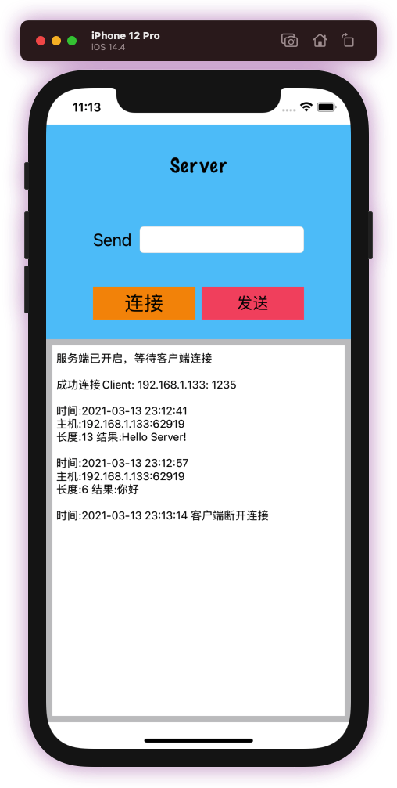
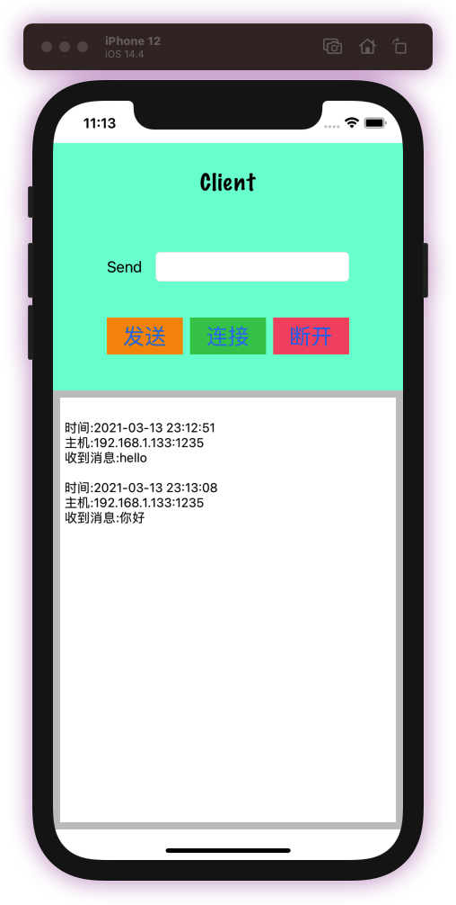

# CocoaAsyncSocket_Server-Client
包含Server端和Client端基于TCP协议的实现，可自行修改host和port后在两台模拟器运行
需要先点击Server端“连接”再点击Client端“连接”
Server端没有断开操作

## Server端使用操作
1、点击“连接”按钮绑定端口并进行监听
2、此时需要等待Client端点击“连接”，不再需要点击Server端“连接”
3、底部log日志显示连接成功后可在SendTextField处输入发送消息并点击“发送”

## Client端使用操作
1、等待Server端点击“连接”
2、Server端log日志显示等待Client连接时，Client端即可点击“连接”
3、点击“发送”发送消息给Server端，点击“断开”即断开与Server的连接，但可重连

## Server端截图

## Client端截图

